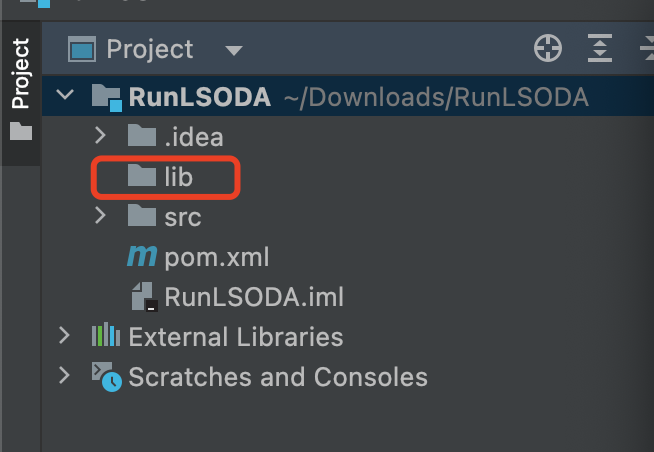
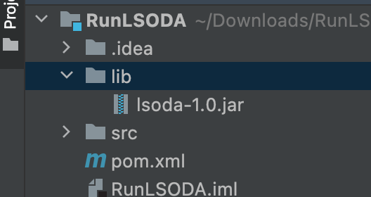
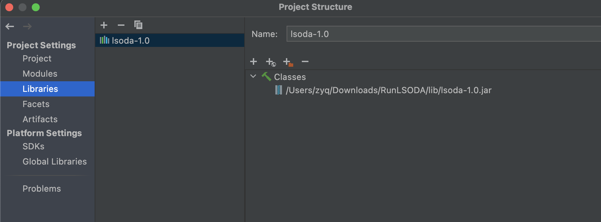

# lsoda-java
Java implementation of the LSODA stiff ODE solver

## Introduction
This the Java implementation of the algorithm LSODA. The original algorithm can be accessed [here](https://epubs.siam.org/doi/abs/10.1137/0904010).
It can be used to solve the non-stiff and stiff ordinary differential equations (ODEs).

This Java version LSODA is ported from the [C version LSODA](http://www.ccl.net/cca/software/SOURCES/C/kinetics2/lsoda-dir/index.shtml).

## Usage
### Generating and importing the jar file
Generate the jar file with the following command:

```
mvn clean package
```
If you are using IntelliJ IDEA, you can generate the package through this IDE. See the details [here](UseJarInIDEA.md).

Now create a new new java project and create a folder *lib*



Copy the generated jar file to this folder



Open the **Project Stucture** and add this jar file in the **Libraries**



Then add the Apache Commons Math dependency in *pom.xml*

```xml
<dependency>
    <groupId>org.apache.commons</groupId>
    <artifactId>commons-math3</artifactId>
    <version>3.6.1</version>
</dependency>
```

### Solving ODEs
Then you can use the package to calculate IVPs. Here is an example for integrating:
y' = 12y. The integration interval is [0,2]

```java
import org.apache.commons.math3.exception.DimensionMismatchException;
import org.apache.commons.math3.exception.MaxCountExceededException;
import org.apache.commons.math3.ode.FirstOrderDifferentialEquations;
import odesolver.LSODA;

public class Main {
    public static void main(String[] args){
        // set the minimum and maximum step sizes, error tolerance and the maximum orders for the methods
        LSODA lsoda = new LSODA(0,0.5,1.0e-6,1.0e-6,12, 5);
        FirstOrderDifferentialEquations ode =
                new FirstOrderDifferentialEquations() {
                    @Override
                    public int getDimension() {
                        return 1;
                    }
                    @Override
                    public void computeDerivatives(double t, double[] y, double[] ydot) throws MaxCountExceededException, DimensionMismatchException {
                        ydot[0] = -12*y[0];  // define the ODE
                    }
                };
        double[] y = {1};  // set the initial value
        double t = 0;
        double tout = 2;  // set the integration interval
        double[] result = new double[1];  // store the integration result
        lsoda.integrate(ode,t,y,tout,result);
        System.out.println(result[0]);
    }
}
```

For more examples, users can refer to *lsoda/test/odesolver/StiffExamplesTest.java*, which includes the stiff examples from the paper [Comparing numerical methods for stiff systems of ODEs](https://link.springer.com/article/10.1007/BF01932994).

Furthermore, this implementation retains the original input parameters. If you wish to further configure the solver, you can invoke the following method:
```java
package org.example;

import org.apache.commons.math3.exception.DimensionMismatchException;
import org.apache.commons.math3.exception.MaxCountExceededException;
import org.apache.commons.math3.ode.FirstOrderDifferentialEquations;
import odesolver.LSODA;

public class Main {
    public static void main(String[] args){
        // create the object
        LSODA lsoda = new LSODA(0,0.5,
                1.0e-6,1.0e-6,12, 5);
        FirstOrderDifferentialEquations ode = new FirstOrderDifferentialEquations() {
            @Override
            public int getDimension() {
                return 1;
            }

            @Override
            public void computeDerivatives(double t, double[] y, double[] ydot) throws MaxCountExceededException, DimensionMismatchException {
                // define the ODE
                // Analytical solution: y = sin^2 x + cos x
                ydot[0] = 2*Math.cos(t)*Math.sin(t)-Math.sin(t);
            }
        };
        double[] y = {1}; // initial value
        double t = 0;
        double tout = 10; // integration interval
        lsoda.ode = ode;
        // error tolerance
        double[] rtol = {0,1.0e-6};
        double[] atol = {0,1.0e-6};
        lsoda.lsoda(1,y,t,tout,1, rtol,atol,1,1,1,0,1000,10,12,
                5,0,0,0.5,0);
        double analyticalRes = Math.sin(tout)*Math.sin(tout)+Math.cos(tout); // analytical solution
        System.out.printf("Analytical solution: y1 = %.16e\n", analyticalRes);
        System.out.printf("Numerical solution: y1 = %.16e\n", lsoda.y[1]);
    }
}
```
More examples of using this calling method can be found in test/odesolver/ITaskAndContinuationTest.java.

For more detailed description and meaning of these parameters, users can refer to [the orginal LSODE descriptions](https://ntrs.nasa.gov/citations/19940030753).