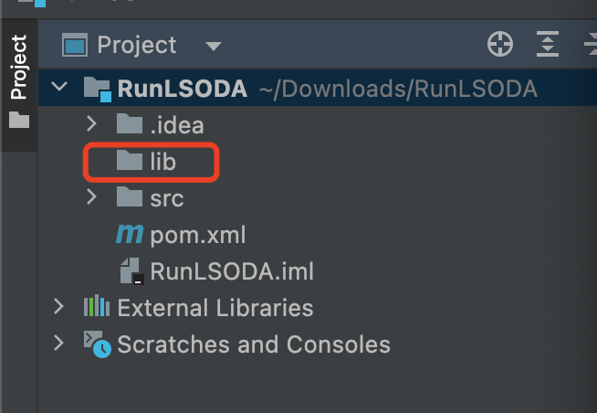

# Generate the JAR file directly in IntelliJ IDEA

Please ensure that you have configured maven in IntelliJ IDEA.
In the case shown in the following pictures, IntelliJ IDEA 2022.1.2 is being used.

First, just click the _package_ button.

Then you can find the file *lsoda-1.0.jar* in the folder *target*.

Now create a new java project and create a folder *lib*.

The next steps can continue to refer to [README.md](README.md).